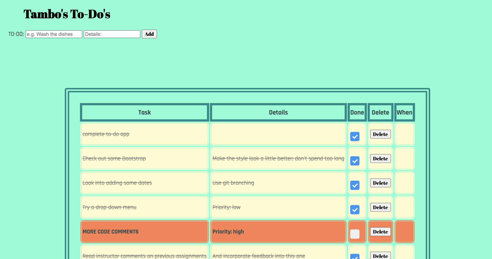

# Tambo's TO-DO's

## Description

_Duration: 2 Day Sprint_

This is a simple application for adding and saving tasks to a list where you can later mark them as complete or delete them if needed.

## Screen Shot

### Prerequisites

- [Node.js](https://nodejs.org/en/)
- List other prerequisites here

## Installation

1. Create a database named `weekend-to-do-app`,
2. The queries in the `database.sql` file are set up to create all the necessary tables and populate the needed data to allow the application to run correctly. The project is built on [Postgres](https://www.postgresql.org/download/), so you will need to make sure to have that installed. We recommend using Postico to run those queries as that was used to create the queries, 
3. Open up your editor of choice and run an `npm install`
4. Run `npm run server` in your terminal
5. Run `npm run client` in your terminal
6. The `npm run client` command will open up a new browser tab for you!

## Usage

1. Enter a task and a brief description into the text fields at the top of the page
2. Click *'Add'* to post the task to the list
3. Click the checkbox in the *'Done'* column to mark a task complete
4. Clicking a *'Delete'* button removes that row from the list

## Built With

- JavaScript
- jQuery
- ExpressJS
- nodejs
- postgresql

## Acknowledgement
Thanks to [Prime Digital Academy](www.primeacademy.io) who equipped and helped me to make this application a reality. Thanks Mo for inspiring some extra styling.

## Support
If you have suggestions or issues, please email me at [myemail@giuno.com](www.google.com)